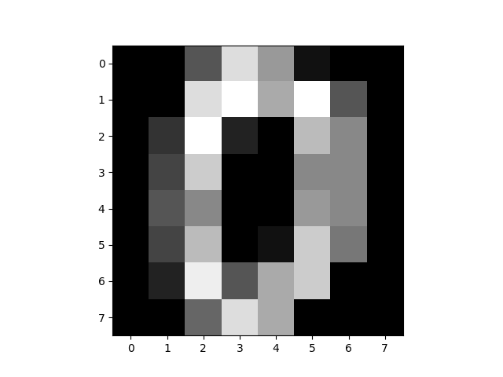
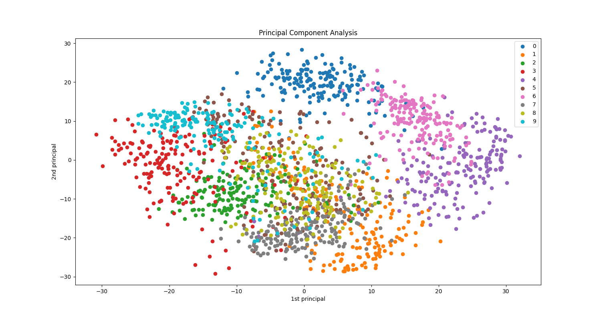
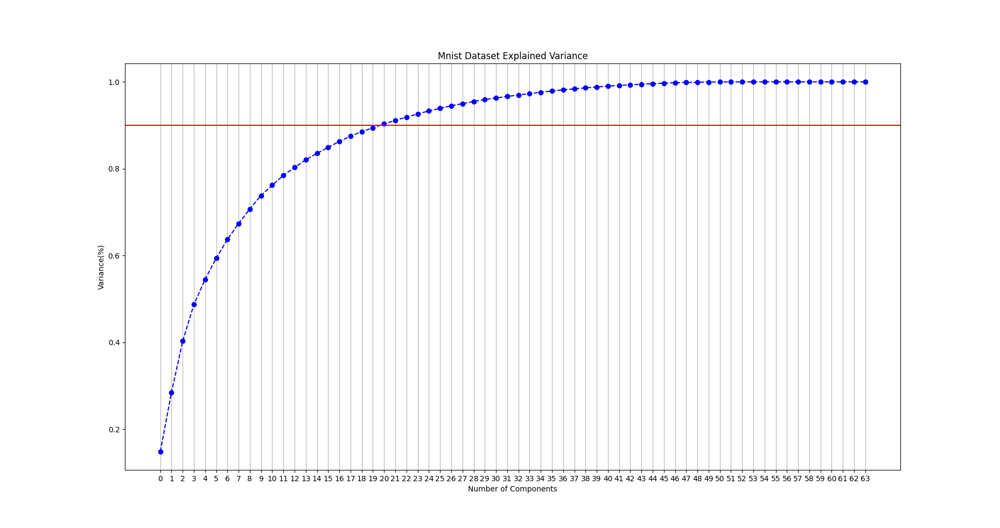

# principal-component-analysis-PCA

For details, see [notebook](PCA.ipynb). PCA is implemented with numpy and scipy to better understand PCA.

### Sample data from MNIST dataset

### Visualization of MNIST dataset after dimensionality reduction using PCA

### Plot of variance explained by eigen values (to choose number of principal components)

